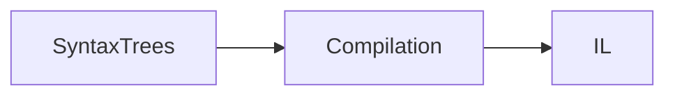
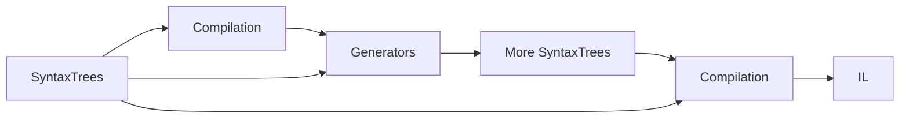
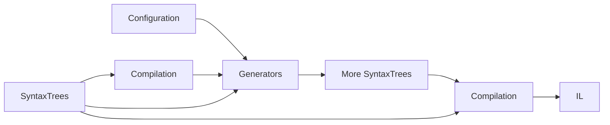
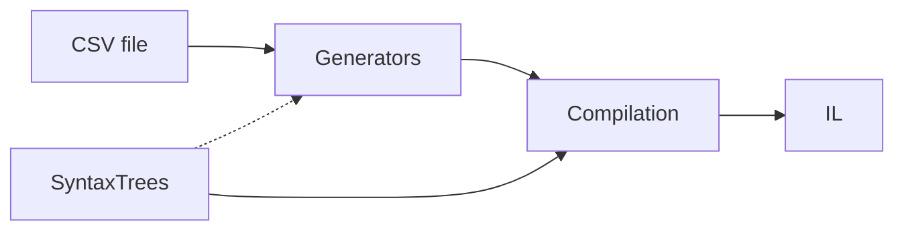
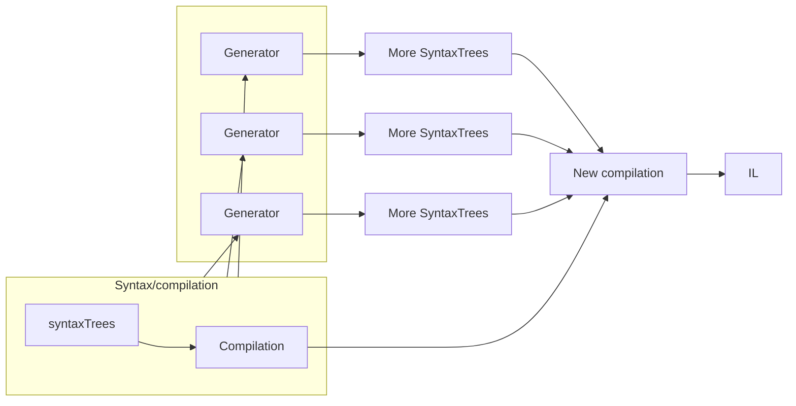
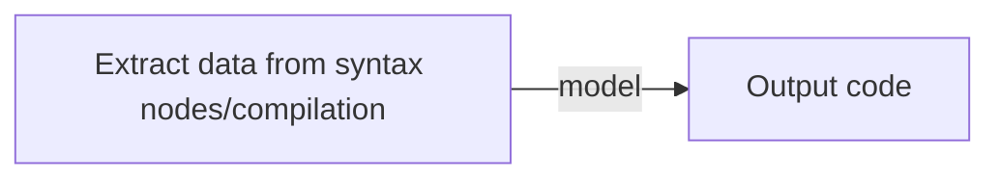

# Roslyn Incremental Source Generators Overview

Source generators are run by the compiler to add C# or VB code to the compilation. Roslyn *incremental source generators* define as a series of steps which allow the generator to avoid unnecessary work if the result in the cache of any step is unchanged. Incremental generators are granular and manage the cache independently for each item in a collection. Incremental generators can be easily canceled by the host process, because any further work by the user invalidates the current generation cycle. These features allow incremental generators to minimize the work performed and provide a pattern that is maintainable and testable.

Source generators run during both design time builds and [[full]] builds. This allows them to extend user code with new code that adds classes, methods and properties that immediately affect the users experience via features like IntelliSense. It also means that generators run very often - each time a new design-time compilation is created, generally when the user pauses typing.

Most programmers will not need to write source generators, but will take advantage of those written by others. If you do write a generator, follow the [Performance Guidelines]() and be [tested for performance]() because your generator can adversely affect the design time performance of editors such as Visual Studio. Source generators are new and we are evolving guidance on banned APIs, so feel free to reach out at [[@Jaredpa and @chsienki where?]] if you want to check the impact of a technique.

> [!CAUTION]
> We will disable generators during the design time build if they are slow or analysis indicates that they do not follow guidelines. We will also report slow generators to users. All generators will run on full builds.

Source generators are an advanced feature. This article assumes that you understand the basics of the [Roslyn compiler](), [syntax trees](), [compilations](), [cancellation]() and the [value and reference equality](). It will also help to have an understanding of functional pipeline techniques using delegates such as lambda expressions.

## How Roslyn generators work

When the Roslyn compiler runs with no referenced generators, it reads user code and builds a set of syntax trees, generally one syntax tree per file. Based on this, the compiler builds a compilation and emits [IL]():



When generators are present, the Roslyn compiler inserts an extra step between creating the compilation and emitting the IL. This step runs the generators and adds any syntax trees they create. The compiler then creates a new compilation which is used to emit IL:



Syntax trees are a full representation of the code the user wrote. Syntax trees are not resolved - for example a method invocation is just the name of the method and not yet connected to the method declaration. Syntax trees are also structurally the same as the input code and very detailed and includes everything in the source file, including whitespace. The compilation includes several things that may be interesting to your generator, including the syntax trees, the semantic model and diagnostics. The semantic model is the resolved logical view of the source code. Because it is resolved, you can access the method declaration from a method invocation, for example. The semantic model does not contain trivia, but does contain supporting information not used in IL, such as XML comments.

Additional information may be needed for generation, perhaps from a configuration:



[[ Review: Is the configuration provider fast enough for us to be comfortable using it in this example. ]]

Generation may use other files. For example, creating a strongly typed wrapper for a comma delimited file (`.csv`) might not use the initial compilation at all, but it is always available to it.



> [!IMPORTANT]
> External files are not part of the user's compilation and therefore generation using them is never needed for design time compilation. These generators should use `RegisterImplementationSourceOutput` rather than `RegisterSourceOutput` to indicate they are only needed during full builds.

[[ Review: The warning above assumes my understanding that merely saving a file does not make it available to design time compilation. Is more nuance needed on this, as in, do these generators require a special article. Also, if saving a file is enough to make it available to design time compilation (and thus it is useful), is the file based provider slow enough we want a warning here? ]]

Each generator uses the same set of syntax trees and compilation, so generators are independent and do not know what was produced by other generators.



Both V1 Roslyn source generators and Roslyn incremental source generators follow these pattern.

### V1 Roslyn source generators

There are two kinds of Roslyn generators: V1 generators and incremental generators. The design of V1 generators does not provide important optimizations such as caching and cancellation. Due to shortcomings in V1 generators, Roslyn incremental generators were created as a second generation of Roslyn source generators with these goals:

* Allow for a finer grained approach to defining a generator.
* Scale source generators to support 'Roslyn/CoreCLR' scale projects in Visual Studio.
* Exploit caching between fine grained steps to reduce duplicate work.
* Support generating more items that just source texts (not yet included).
* Exist alongside ISourceGenerator based implementations.

All new generators should be incremental source generators.

> [!CAUTION]
> Because generators run in the editor, we plan to allow disabling slow generators and we may add rules that ensure best practices. In the future, V1 generators may fail these metrics or be deprecated and run only on full builds.

[Transitioning V1 generators](transitioning-v1-generators.md) contains tips for transitioning.

### Incremental generators

Incremental generators are built as a series of steps that collect data, transform the data if necessary, and output code. These steps are defined via delegates (such as lambda expressions) to create the pipeline. The generator caches the result of each step and assumes that further steps are unneeded if their input is unchanged. The previous cached value of those later steps is used instead.

This incremental generator design allows cancellation at each step, and supports the code of each step responding to cancellation. When the user is editing, your generator is likely to be canceled more often than its results are used, because any changes to the user's code invalidates the previous compilation.

In addition to these benefits to how your generator runs, the incremental generator design isolates evaluating input to create a model from transforming the model and isolates creating of code. Once you understand this approach, isolation makes your generator easier to design and test.

The incremental generators design is based on a pipeline. As a simple example, you might extract the syntax nodes that have a specific attribute applied and evaluate those nodes to extract some data which you use to create source code:



In the pipeline, the extraction step is a delegate and the step to output code is a separate delegate.

The most common case is to extract data, transform it, and then output code, each as a separate delegate passed to one of the pipeline methods:


The majority of time that your generator runs, the code it depends on will be unchanged because the user is editing some other part of their solution. 

Stepwise generation allows for complex generators when they are needed. For example, you may need to gather data from orthogonal syntax nodes, external files or other sources. Your transformation may involve multiple steps combining and summarizing individual sources. And you may output multiple files. Treating each of these as an independent step allows you to understand each step and test and debug it separately. It may take a bit to shift into the functional mindset of delegates in a pipeline, but the payoff of an logical, efficient, and testable generator makes it worth the effort.

[[ Review; mention of using external files - good or bad ]]

## Limitations of generators

Source generators are designed to protect user code and user's expectation about their code, as well as minimizing the impact on performance. As a result, both the V1 Roslyn source generators and Roslyn incremental source generators have limitations.

### Generators cannot change user code

Programmers expect that the code they write will run. Roslyn source generators support this assumption by never changing user code. You can add new syntax trees to the compilation, but you cannot change the existing syntax trees.

### Generated code cannot be altered by the user

Once code is generated, the user cannot change it. This is enforced by Visual Studio, but more importantly the next compilation would ignore and overwrite any user changes.

To create code the user can edit, use [.NET templating]().

### Generated code must be in a separate `SyntaxTree` or file

The code you generate is added to the compilation as a new `SyntaxTree`, and appears in the IDE as a separate file that appears in solution explorer in Dependencies/Analyzers/name of generator. You can combine user-written code and generated code into a single class using partial classes.

### Generators cannot run any code of the project they are compiling

It can be difficult to imagine your the source code of your application as a block of data that cannot be executed, but during compilation that is what your code is - data. For example, given the following code:

```csharp
var x = 2 + 3;
```

You can access `x` only as a specific `SyntaxNode` and `ISymbol` that has no value. Since no code runs, there is no value and the value `5` is never associated with this line of code [[ right, optimizations are not visible? ]]. `2 + 3` is another specific `SyntaxNode` and `ISymbol`, as are `2`, `3` and `+`.

In this simple case, you could retrieve the string values of 2 and 3 from the syntax nodes. However, you cannot handle all cases and we recommend analyzers to limit input to the simplest forms that can express user intent. In this case, that would be the value 5.

### Generators cannot reliably run code that is not part of the NuGet package

Generators are use a host specific assembly load context. This is host specific because hosts have different needs. Assembly load behavior of generators is an implementation detail that is highly complex, will change as needed and cannot reliably load any code not in the NuGet package. In addition, any assembly loading would have unacceptable performance impact. 

### Generators should not throw, even on invalid input code

Generators do not need to output code when inputs are invalid, but, they must not throw exceptions. If they do, the generator will fail with no message, or a cryptic message. Generators should be very protective of any possible exceptions.

### Generated code always runs in the context of the user's source code

This may be obvious, but the code your generator creates will run in an unknown context. You do not know what settings will be present for warnings, code style, or null reference types. For example, your generated code may run in a project that requires XML comments and has `WarningsAsErrors` set to true. In that context, if you fail to include XML comments, your generator will break the user's ability to compile their project!

As a result, generators should be written with the expectation of most warning turned on. 

[[ Review: is code style fixed after generators run? ]]

### Generators cannot be ordered or dependent

Each generator is independent and does not rely on any other generator. Any mechanism for ordering or dependency between generators will eventually result in a conflict with no realistic route to resolution by the user of conflicting generators.

Also, generators depending on other generators would require the compilation to be recreated many times, and we do not believe we could do this and preserve design time performance.

We are aware that some small loosening of this restriction would be useful, and are working on designs in this space, possibly involving a small number of specific generation phases. [[ Review: do we have an issue on this we can link? ]]

### Generators only create C# and Visual Basic code

While generators can read files for additional input, such as configuration information, they can only add to a compilation, and cannot output files directly. We would like feedback about your scenario if you need to output files that are not VB or C# code. [[ Review: do we have an issue on this we can link? ]]
