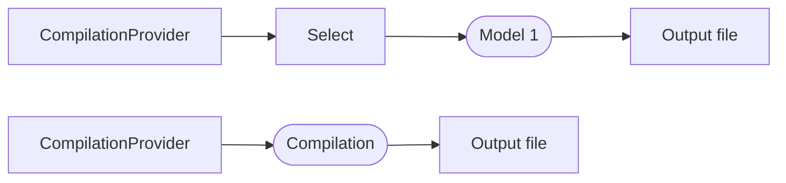
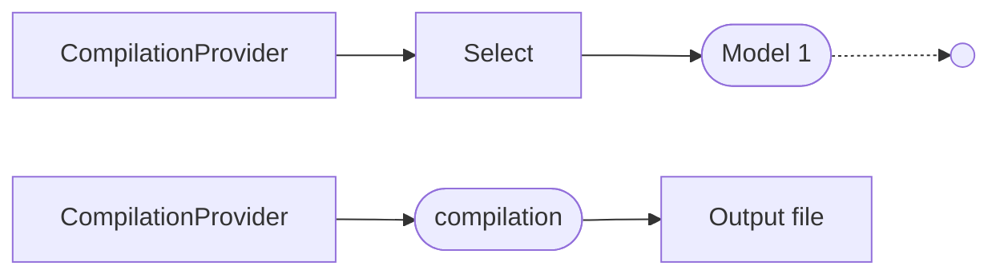

@chsienki Do immutable arrays use ref equality, or do they use the ImmutableArrayValueComparer in SyntaxValueProvider by default

# Performance Guidelines

Your generator runs during your user's design time compilation and a slow generator can create performance issues. You partner with us to maintain good design time performance for editors like Visual Studio users. Most of the time your generator is called something in the application unrelated to your generator has changed, making a full run of your generator unnecessary. Many of these tips are to design your generator to support incremental source generator's use of a cache to skip steps when the input is unchanged.

The most important things to maintain performance are:

* Do not do slow or unusual things.
* Use cancellation tokens.
* Use APIs where available.
* Access the compilation early and rarely.
* Ensure value equality, including collections.
* Build a model early and do further work on this model.
* Do not attempt to cache yourself or to save partially generated work.

> [!WARNING]
> If your generator is affecting that performance, we will remove it from the design time compilation. If that happens, your uses will provably see errors in their code and missing IntelliSense until they explicitly build. This area will evolve, both in how we mark generators and in the tools available for you to understand the performance of your code.

You should understand [Roslyn incremental generator overalldesign](overview.md) and how the [incremental generator pipeline](pipeline.md) works before reading this section.

## Do not do slow things

Do not do things that are slow. Do not do tricky stuff. Don't emit code, don't write files, etc. If there is something you need to do, chat with us. We reserve the right to mark or remove badly behaving generators from design time compilation and to ban certain APIs. If you aren't sure, ask us about impact on incremental generator performance[[ Review: how and where or do we want to not say this? ]].

## Use cancellation tokens

Generators will run often, very often while the user is active in the designer. The are kicked off asynchronously and another generation is often started before the first complete. During parts of the inner loop, your generator will be cancelled much more often than it runs to completion. It is essential to use cancellation tokens to avoid hurting performance in three cases:

* You are calling any operation that takes a cancellation token.
* You are executing an unbounded loop, even if your believe the iteration count will never be large.
* Before any operation that may be slow.

The pipeline infrastructure will cancel the pipeline between steps.

## Use APIs where available

We will add APIs for operations that are difficult to do correctly or difficult to do without hurting performance. As these APIs become available, it is important to use them for new generators and convert old generators to use them. An example of an upcoming API (17.3) is an API to get the syntax nodes a specified attribute is placed on. [Find out more about `ForAttributeWithMetadataName<T> in the pipelines article](pipeline.md#syntaxvalueprovider).

One set of available APIs is the `IOperation` APIs. These APIs are easier to use than directly accessing the semantic model, they are fast, and they allow VB/C# language neutral source code access for the semantic elements they support.

For more on working with APIs from different versions of Visual Studio, see [Managing VS versions and new APIs](tips.md#managing-vs-versions-and-new-apis).

## Ensure value equality

Incremental generators compare the results of each step with previous results and uses the cached value and uses the cached value if unchanged. If you use reference equality the cache will always fail. Use records or define your own equality and `GetHashCode()` method.

If your model includes a collection, you will have to do additional work to supply value equality since Lists and arrays have reference equality by default. You must write your own `Equals` and `GetHashCode()` methods and explicitly request `SequenceEqual`, even if you are using records.

## Build a model early in the pipeline

Value equality works best with simple data, and carrying syntax nodes, semantic model elements, file handles, or other input artifacts through the generation process can be problematic for performance and makes it more difficult to [test incremental generators](testing-generators.md). Making it easy to extract data from these inputs early and use any cached results is one of the most significant benefits of incremental generators.

Your model does not need to be complicated, and may be as simple as a single value. 

Your model may be complicated and require [transforming data from multiple sources](complex-transformations.md). Ensure each step captures the data you need and accesses the syntax nodes early in the compilation and do not access compilation more than necessary.

Using a model not only makes it easier for your generator to perform well, you can also create models in unit tests for later parts of your generator like creating code.

## Access the compilation early and rarely

The compilation will change on every invocation of your generator and it cannot be cached. Because of this all operations before you use the compilation will always run. You access the compilation when you access anything in the semantic model or access the compilation directly such as through the `CompilationpProvider`. 

Consider two pipelines - the first with a model that has value equality and is created from the compilation provider and the second uses the compilation directly: 

If something is changed that triggers generation, which is unrelated to this generator, the generator recognizes that the model is unchanged, via value equality with the cache, and does not output the file. The version that passes the compilation to the output step always outputs the file:

This guideline refers to every part of the compilation. Avoid including anything you do not know has full value equality meaning that it has value equality and everything it references has value equality. That means avoiding including the compilation, semantic model, `SyntaxNode`, `ISymbol`, `IOperation` or similar parts of the compilation.

## Consider the order of operations

[[ Review: Are any or all of these important. What else? Sections not yet written.]]
* Use resources carefully and close as early as possible [[Should we say to only use external files with APIs. What are the key issues here.]].
* Avoid closures. [[Thinking of ensuring the context is only accessed via the lambda parameter by using the same name.]]
* Do not throw exceptions. [[This seems to also be a usability issue.]]
* Does RegisterSourceOutput cache the source. Would it be helpful to create in transformations? Would a code model be helpful there?
* Should I switch everything in my generator to structs or with value equality are classes fine?
* Sometimes, I have code that should output if conditions are met, but otherwise not - via a ...ValueProvider. If I pass an empty string to AddSource, is anything created?

Also, please review the sample for perf issues. Currently at https://github.com/KathleenDollard/incremental-samples